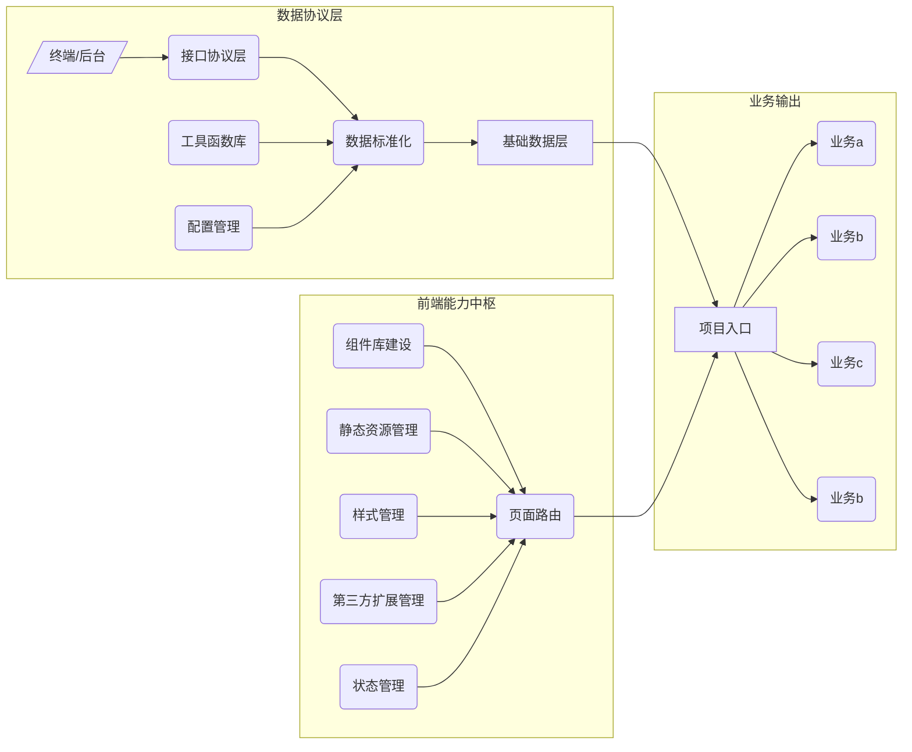

# x-temp

> 前端框架V1.0版本

```mermaid
graph LR
subgraph 数据协议层
L[/终端/后台/] --> K(接口协议层)
K --> F(数据标准化)
G(工具函数库) --> F
N(配置管理) --> F
F --> O[基础数据层]
end
O --> E[项目入口]
subgraph 业务输出
E --> A(业务a)
E --> B(业务b)
E --> C(业务c)
E --> D(业务b)
end
subgraph 前端能力中枢
H(组件库建设) --> P
I(静态资源管理) --> P
J(样式管理) --> P
M(第三方扩展管理) --> P
Q(状态管理) --> P
end
P(页面路由) --> E
```

虽然框架不完美，但是有一个向往完美的心，持续完善中... ...